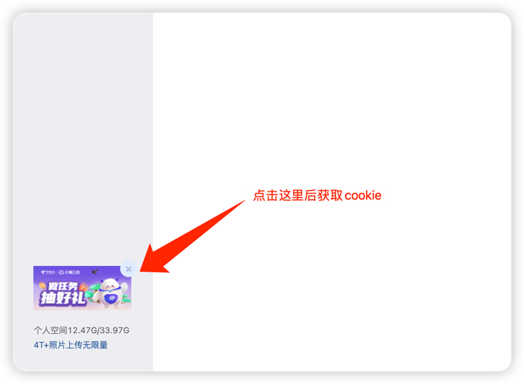

# 
## 👉 [设置 github action 保姆级教程](https://github.com/hudiemon/course/blob/main/README.md)👈
| 任务名称      | 支持情况 | Secrets          |
|-----------|------|------------------|
| 签到        | ✅    | `COOKIE`         |
| 抽奖        | ✅    | `COOKIE`         |
| 抽奖        | ✅    | `COOKIE`         |
| 飞书webhook | ✅    | `WEBHOOK_FEISHU` |
每日收益：100M+
## 运行结果示例
```
天翼云盘
👤【用户】131****6804@189.cn
🍩【签到】签到成功，获得47M
🎉【抽奖】天翼云盘50M空间
🎉【抽奖】天翼云盘50M空间
📈【容量提升】1%
🔋【网盘容量】200.409 MB / 30.387 GB
```

## LICENSE
MIT

